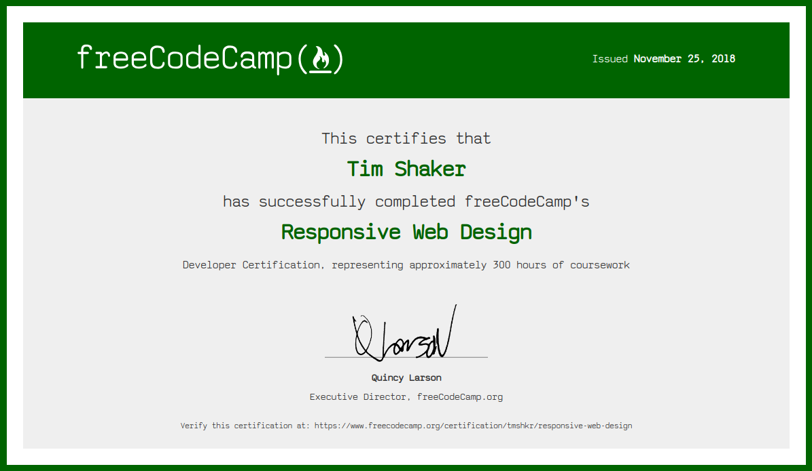

Responsive web design encompasses all of the techniques and practices used to ensure that
a website adapts to the many different devices and screen sizes that might access
it. This website, for example, will change how it is displayed depending
on the size of the browser's viewport, so that it is optimized for both mobile and desktop
use. The days of making a webpage for a fixed screen size are over, now that
[web traffic is evenly split between mobile and desktop browsers](http://gs.statcounter.com/platform-market-share/desktop-mobile-tablet/worldwide/#monthly-201710-201810).

Though I've been practicing responsive web design for a few years, I learned
a lot from freeCodeCamp's Responsive Web Design certification program, which I
have now successfully completed:

<a href="https://www.freecodecamp.org/certification/tmshkr/responsive-web-design" alt="Responsive Web Design Certification" target="_blank">

</a>

The program started off with a basic introduction to HTML, which is always good to
revisit, since these are the fundamental building blocks of a webpage. It then transitioned
into CSS and visual design, which gives a webpage its look and feel.
As the popular analogy goes, if a webpage is a house, then HTML is the
wooden frame, while CSS is the drywall and the paint. Like any good carpenter, one
could spend years mastering just these two techniques to be able to create some
truly amazing designs. With new HTML and CSS features continuing to be implemented,
there's always something to learn, as new features gain wider browser support.

Flexbox and CSS grid are two more recent CSS features that I had shied away
from before, due to the spotty browser support, but they are now [widely](https://caniuse.com/#feat=flexbox) [supported](https://caniuse.com/#feat=css-grid)
by Chrome, Safari, Firefox, and Edge --- with Internet Explorer being discontinued,
it often doesn't make sense to avoid using these extremely useful features that make frontend
design easier, better, and more concise.

Centering content, for example, once involved all sorts of strange hacks, like negative margins and transforms
--- vertical centering was frustrating if not impossible. Now one all one needs to do is
merely `display` the parent container as a `grid` in order to `justify` and `align`
content to the `center`.

<style>
.perfect-center {
    display: grid;
    height: 15em;
    background: darkblue;
    justify-content: center;
    align-content: center;
}
</style>

<div class="perfect-center">
Perfectly Centered
</div>

 
```css
.perfect-center {
    display: grid;
    justify-content: center;
    align-content: center;
}
```

The projects for the Responsive Web Design certification program were where most
of the learning happened, as I got to practice making layouts with CSS Grid, Flexbox,
and other responsive web design techniques. The projects I made are available to view and fork
on my [Codepen profile](https://codepen.io/tmshkr/): a [tribute page](https://codepen.io/tmshkr/pen/vVXOvV), a [survey form](https://codepen.io/tmshkr/pen/QZPXew),
a [product landing page](https://codepen.io/tmshkr/pen/MPdymB), a [technical documentation page](https://codepen.io/tmshkr/pen/oaKzNW),
and a [personal portfolio webpage](https://codepen.io/tmshkr/pen/vQEmJj).

The certification program also went into accessibility techniques, which help users
with visual impairments to better access content on a website through screen readers and
high-contrast text. Accessibility best practices aren't always obvious to sighted
designers and developers who are used to a website being mainly a visual project,
so it was helpful to practice with these techniques. I often find myself using the
accessibility tools [Read Aloud](https://addon.readaloud.app/) and [Dark Reader](https://darkreader.org/)
because they make text easier to read, especially when reading long passages
of text on a screen all day. Technology empowers users with a potentially limitless
amount of ways to do things, which can be a blessing when it helps but a curse
when there is no clear solution. Experience tends to be the best guide in those
kinds of situations.
